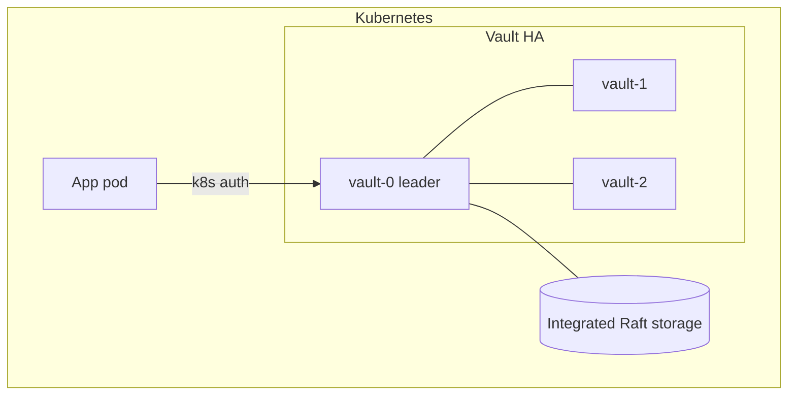

# vault-on-kubernetes

Deploy **HashiCorp Vault** on Kubernetes in **High Availability** mode with **integrated Raft
storage** and **Kubernetes auth**, using the official Helm chart. Includes the values, init/unseal
steps, and a worked example of a pod retrieving a secret via the Kubernetes auth method.

This repo is the hands-on companion to the article
*"Deploying and Managing HashiCorp Vault in Kubernetes with HA and Raft Storage"*
([dev.to/durrello](https://dev.to/durrello/deploying-and-managing-hashicorp-vault-in-kubernetes-with-ha-and-raft-storage-np3)).

## Architecture



- 3 Vault replicas forming a Raft cluster (no external storage backend needed).
- Kubernetes auth method so pods authenticate with their ServiceAccount token.
- Secrets are injected via the Vault Agent Injector.

## Layout

```
.
├── helm/values.yaml            # HA + Raft Helm values
├── policies/app-policy.hcl     # Example read-only policy
├── examples/
│   ├── app-deployment.yaml     # Pod using the agent injector annotations
│   └── secret-setup.sh         # Enable KV, write a secret, bind the policy
└── scripts/
    ├── install.sh              # helm install Vault
    └── init-unseal.sh          # Initialize + unseal the cluster
```

## Quick start

```bash
# 1. Install Vault in HA + Raft mode
./scripts/install.sh

# 2. Initialize and unseal (saves keys locally — protect them!)
./scripts/init-unseal.sh

# 3. Configure auth, a secret, and a policy
kubectl exec -it vault-0 -- sh
# then run the commands in examples/secret-setup.sh
```

## What this demonstrates

- Vault HA with integrated Raft (Vault manages its own consensus storage)
- Kubernetes auth method binding ServiceAccounts to Vault policies
- Least-privilege policy design (read-only on a specific path)
- Secret injection into application pods via the Agent Injector

## Security notes

- `init-unseal.sh` writes unseal keys and the root token to a local file. **These are the keys to
  everything** — in production use auto-unseal (KMS/Transit) and never store them in plaintext.
- The example policy grants read-only access to a single path. Scope policies tightly.
- This is a learning deployment; production needs TLS, auto-unseal, audit devices, and backups.

## License

MIT
